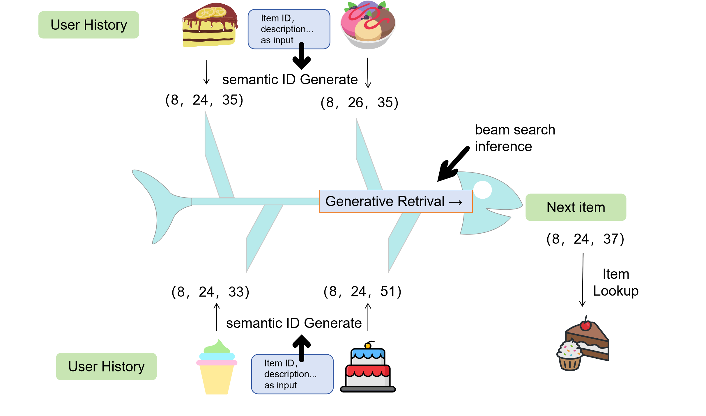
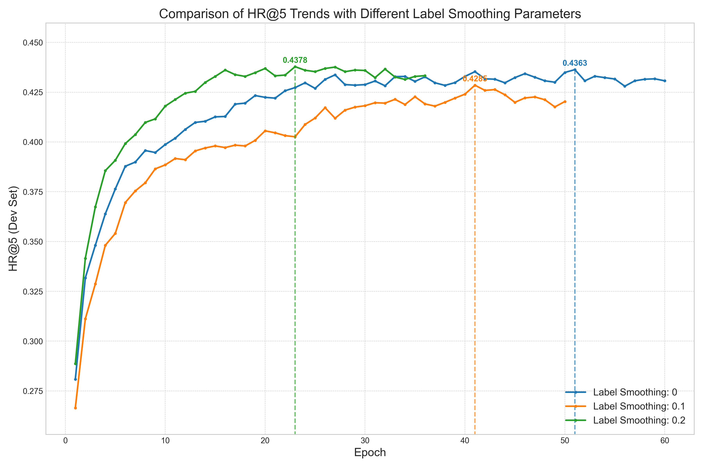

# RecTIGER: ReChorus 框架下的 TIGER 模型复现

[]()
[](./LICENSE)
[](https://github.com/THUwangcy/ReChorus)
[](https://arxiv.org/abs/2305.05065)


## 📖 简介

**RecTIGER** 是基于清华大学 [ReChorus 2.0](https://github.com/THUwangcy/ReChorus) 框架扩展的推荐系统研究项目。本项目的主要目标是复现 NeurIPS 2023 论文 **"Recommender Systems with Generative Retrieval" (TIGER)**，将生成式检索范式（Generative Retrieval）引入到通用的序列推荐框架中。

不同于传统的“召回+排序”或基于 MIPS 的向量检索，TIGER 将推荐任务重构为 **Seq2Seq 的生成任务**。模型通过学习物品的 **Semantic ID（语义 ID）**，利用 Transformer 解码器自回归地生成用户下一时刻可能交互物品的 ID 序列。

本项目保留了 TIGER 语义索引的核心特性，同时无缝接入 ReChorus 的数据管道、训练器和评估模块，并添加了 **Label Smoothing** 等优化策略。


## ✨ 核心亮点

*   **无缝集成**：基于 ReChorus 的 `Reader/Runner/Model` 模块化架构重构，复用框架的高效数据加载与 Top-K 评估流程。
*   **语义 ID 适配**：实现了 `TIGERReader`，支持自动加载离线生成的 RQ-VAE 编码文件（`.npy`），并支持缺失编码时的确定性 ID 降级策略。
*   **生成式检索实现**：基于 HuggingFace `T5ForConditionalGeneration` 实现了 `TIGER` 模型类，支持 Encoder-Decoder 架构训练与 Beam Search 推理。
*   **性能优化**：
    *   在解码阶段引入 **Label Smoothing** 正则化，缓解在稀疏数据集上的过拟合问题。
    *   支持 `corpus.item_codes` 的延迟加载机制，避免修改原始数据管道。

## 📂 项目结构

```text
src/
├── models/                  #包含ReChorus原生模型
│   └── sequential/
│       └── TIGER.py         # TIGER 模型核心实现 (继承自 SequentialModel)
├── helpers/
│   ├── TIGERReader.py       # 专用数据读取器，处理语义 ID (.npy) 加载与映射
│   ├── TIGERRunner.py       # 专用运行器，保留生成任务扩展接口
│   └── ... (ReChorus base files)
├── main.py                  # 统一入口
└── ...
data/
├── Grocery_and_Gourmet_Food/ #本实验使用数据集
└──MovieLens_1M/
   └──ML_1MTOPK/              #本实验使用数据集
```

## 🚀 快速开始

### 1. 环境准备

本项目依赖 PyTorch 与 Transformers 库。

```bash
#下载项目
git clone git@github.com:2323top/RecTIGER.git

# 安装依赖
pip install -r requirements.txt
# 额外确保安装了 transformers
pip install transformers
```

### 2. 数据准备

请遵循 ReChorus 的标准数据格式（csv/txt），将数据放置在 `data/<DatasetName>/` 目录下。（本项目已配置好，可直接使用，无需额外运行）

**关于语义 ID (Semantic IDs):**
TIGER 依赖 RQ-VAE 生成的离散码本作为物品 ID。
*   **推荐方式**：将离线生成的 RQ-VAE 编码保存为 `.npy` 文件（例如 `item_codes.npy`），放置在数据集目录下。`TIGERReader` 会自动发现并加载。
*   **降级方式**：如果未提供 `.npy` 文件，`TIGERReader` 将根据 `codebook_k` 和 `num_codebooks` 自动生成确定性的伪语义编码，以保证代码可运行（仅用于调试流程，无语义增益）。

### 3. 运行训练

使用命令行参数直接启动训练，以下是在 Amazon Grocery 数据集上的示例命令：

```bash
# 切换到项目入口目录
cd src

# windows上运行
python main.py --model_name TIGER --emb_size 64 --lr 1e-3 --l2 1e-6 --dataset Grocery_and_Gourmet_Food --gpu 0 --num_workers 0 --regenerate 1

# linux上运行
python main.py --model_name TIGER --emb_size 64 --lr 1e-3 --l2 1e-6 --dataset Grocery_and_Gourmet_Food --gpu 0 --regenerate 1

#以上是原项目复现版本，以下为我们加入平滑项后的改进版本(linux)
python main.py --model_name TIGER --emb_size 64 --lr 1e-3 --l2 1e-6 --dataset Grocery_and_Gourmet_Food --gpu 0 --label_smoothing 0.2

# 改进版本（windows）
python main.py --model_name TIGER --emb_size 64 --lr 1e-3 --l2 1e-6 --dataset Grocery_and_Gourmet_Food --gpu 0 --label_smoothing 0.2 --num_workers 0
```

## 🧠 模型详解

### TIGER (Transformer Index for GEnerative Recommenders)

TIGER 的工作流程分为两阶段：

1.  **Semantic ID 生成 (离线)**:
    利用 **RQ-VAE (Residual-Quantized Variational AutoEncoder)** 对物品的文本内容（标题、描述等）进行编码。通过残差量化，每个物品被映射为一个由 $m$ 个离散码字组成的元组 $(c_1, c_2, ..., c_m)$。

2.  **生成式检索 (在线)**:
    *   **Encoder**: 将用户交互历史中的物品替换为对应的 Semantic ID 序列，输入 Transformer 编码器。
    *   **Decoder**: 基于编码器的上下文，预测用户下一个交互物品的 Semantic ID。
    *   **Inference**: 使用 Beam Search 生成概率最高的 $K$ 个语义 ID 序列，并通过前缀匹配检索回原始物品。

### 改进点：Label Smoothing

观察到 TIGER 训练中存在缓慢收敛的情况，参考 Transformer 等序列任务常用的 Label Smoothing（LS），我们尝试在 decoder 端对目标分布做平滑，缓解过拟合并加快收敛。
我们将 decoder 目标分布从 one-hot y平滑为 ：

$$
\mathbf{y}^{\text{(ls)}} = (1 - \epsilon) \cdot \mathbf{y} + \epsilon \cdot \frac{1}{V}
$$

其中 V 是词表大小，ϵ 为 label smoothing 系数。训练损失仍是 token-level 交叉熵，但用 y′替代 one-hot，并忽略 PAD token。本实验固定其余训练设置不变，仅取 ϵ∈{0,0.1,0.2} 做三个对比实验。
实验结果（如下图）表明，设置 `epsilon=0.2` 能在 Grocery 数据集上带来一定的性能提升且训练收敛速度更快。


## 📊 实验结果

我们在 **Amazon Grocery** (稀疏) 和 **MovieLens-1M** (稠密) 数据集上进行了对比实验，此处仅展示前者。

| Dataset | Model | HR@5 | NDCG@5 | HR@10 | NDCG@10 | HR@20 | NDCG@20 | HR@50 | NDCG@50 |
| :--- | :--- | :---: | :---: | :---: | :---: | :---: | :---: | :---: | :---: |
| **Grocery** | GRU4Rec | 0.3710 | 0.2655 | 0.4763 | 0.2995 | 0.6041 | 0.3317 | 0.8187 | 0.3743 |
| | SASRec | 0.3729 | 0.2726 | 0.4684 | 0.3032 | 0.5763 | 0.3304 | 0.7810 | 0.3708 |
| | TIGER | **0.3934** | **0.2973** | **0.4855** | **0.3270** | **0.6016** | **0.3562** | **0.7938** | **0.3942** |

**结论：** TIGER 在具有丰富语义且交互稀疏的场景下（Grocery）表现出 SOTA 性能，验证了语义索引的有效性。


## 🔗 引用

如果本项目对您的研究有帮助，请引用原始论文与 ReChorus 框架：

```bibtex
@inproceedings{rajput2023recommender,
  title={Recommender Systems with Generative Retrieval},
  author={Rajput, Shashank and Mehta, Nikhil and Singh, Anima and others},
  booktitle={Advances in Neural Information Processing Systems},
  year={2023}
}

@article{wang2020rechorus,
  title={ReChorus: A Comprehensive Learning Framework for Recommendation},
  author={Wang, Chenyang and others},
  journal={arXiv preprint arXiv:2005.13602},
  year={2020}
}
```

## 📄 许可证

本项目遵循 MIT License。详情请参阅 [LICENSE](./LICENSE) 文件。
